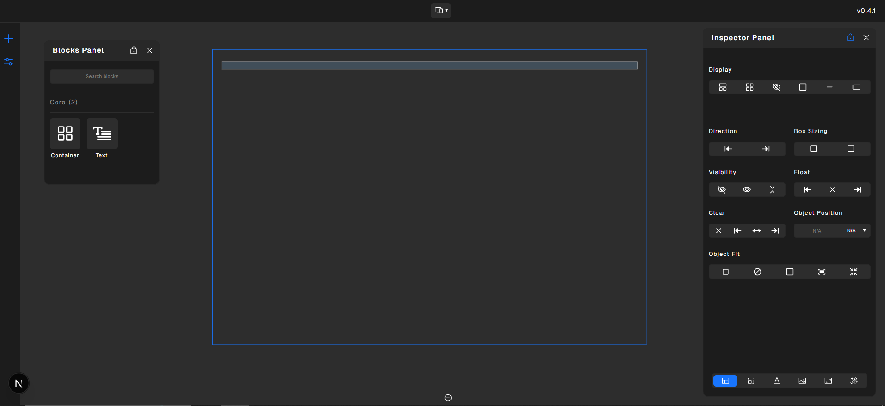

# Triax Page Builder

 

[](https://demo.chouseinkechagia.com/)

> **Extensible visual page builder for React with advanced styling capabilities**



Triax is a modular, registry-based page builder for React that provides a complete visual editing experience. Built with TypeScript and Zustand, it features a sophisticated block system, advanced style editor with token-based styling, and a flexible workbench architecture designed for extensibility and performance.

**⚠️ Current Status:** Under heavy development (v0.5) - Core architecture and APIs may change. Not recommended for production use yet.

---

## Key Features

### Registry-Based Architecture
- **Centralized Management:** All components (blocks, layouts, viewports, workbenches) registered in type-safe REGISTRY_DEFINITIONS
- **Plugin-Ready:** Extensible registry system allows plugins to register custom components
- **Validation Pipeline:** Built-in validation ensures data integrity across all operations
- **Lazy Initialization:** Sequential initialization process with dependency management

### Advanced Block System
- **Block Registry:** Centralized `NodeRegistry` for managing all block definitions and instances
- **Hierarchical Structure:** Nested block support with parent-child relationships
- **Type-Safe Definitions:** Full TypeScript interfaces for `NodeDefinition` and `NodeInstance`
- **Block CRUD Operations:** Comprehensive managers for create, read, update, delete, copy, paste operations
- **Drag & Drop:** Visual block reordering with validation (in progress)
- **Permitted Content Rules:** Define which blocks can contain others
- **Custom Block Plugins:** Register custom blocks via the registry system

**Current Blocks:**
- Container (div, section, article, aside, nav)
- Text (span, p, h1-h6, label)

### Professional Style Editor
- **Token-Based System:** All CSS data types, keywords, and functions represented as tokens
- **Slot-Based Value Editing:** Incremental, context-aware editing for complex CSS patterns
- **Comprehensive Property Support:** Full CSS property coverage with organized categories
- **Responsive Styling:** Device, orientation, and pseudo-class specific styles
- **Lookup Tables:** Optimized style resolution with centralized definitions
- **Validation & Error Feedback:** Real-time CSS validation against specifications
- **Style Cascade:** Proper inheritance and style propagation through block hierarchy

**Style Selectors:**
- **Device Selection:** Desktop, tablet, mobile breakpoints
- **Orientation Support:** Portrait and landscape styling
- **Pseudo-Class States:** Hover, focus, active, visited, and more

### Flexible Layout System
- **Panel Architecture:** Modular panel system for organizing editor UI
- **Dynamic Panels:** Draggable, resizable panels with lock/unlock functionality
- **Bars & Tabs:** Organized navigation with action bars and tabbed interfaces
- **Workbench System:** Multiple workspace modes (Design, Logic, Semantics, Main)
- **Context-Aware UI:** Panels adapt to selected block and current workbench

**Core Panels:**
- **Block Library:** Searchable, categorized list of available blocks
- **Block Inspector:** Edit block attributes and styles for selected block
- **Block Hierarchy:** Visual tree representation of page structure

### State Management
- **Zustand-Powered:** Lightweight, performant state management
- **Modular Stores:** Separate stores for blocks, layout, and page state
- **Manager Services:** Clean API layer abstracting store operations
- **Reactive Hooks:** Real-time UI updates with optimized re-renders
- **Validation Pipeline:** Consistent data validation across all operations

### Extensibility & Services
- **Service Layer Architecture:** Managers (CRUD, Registry, Page) and Helpers (Fetch, Validate, Block operations)
- **Helper Utilities:** Reusable functions for block operations, validation, and data fetching
- **Manager Pattern:** Organized business logic with clear separation of concerns
- **Plugin System:** Register custom blocks, panels, workbenches, and actions

---

## Architecture Overview

Triax follows a **layered, modular architecture** designed for maintainability and extensibility:

```
src/core/
├── config/          # Configuration & definitions
│   ├── blocks/      # Core block definitions (container, text)
│   ├── layouts/     # Panel, bar, and tab definitions
│   ├── viewports/   # Viewport configurations
│   ├── workbenches/ # Workbench definitions (design, logic, etc.)
│   ├── page/        # Page-level configs (device, orientation, pseudo)
│   └── init/        # Initialization steps and sequences
│
├── core/            # Type definitions & interfaces
│   ├── block/       # Block types and interfaces
│   ├── editor/      # Editor types (layout, workbench)
│   ├── page/        # Page types (device, orientation, pseudo)
│   └── init/        # Initialization types
│
├── services/        # Business logic layer
│   ├── managers/    # High-level operations (CRUD, registry, page)
│   └── helpers/     # Utility functions (fetch, validate, block ops)
│
├── state/           # State management
│   ├── REGISTRY_DEFINITIONS/  # Component REGISTRY_DEFINITIONS (singleton pattern)
│   └── stores/      # Zustand stores (block, layout, page)
│
└── ui/              # React components
    ├── editors/     # Editor components (page, viewport, workbench, layout)
    ├──   # Block inspector and property editors
    ├── blocks/      # Block render components
    ├── views/       # View components (hierarchy, library)
    ├── actions/     # Action components
    └── benches/     # Workbench implementations
```

### Key Design Patterns

- **Registry Pattern:** Centralized component registration with validation
- **Manager Pattern:** Service layer abstracting store operations
- **Store Pattern:** Zustand stores for reactive state management
- **Provider Pattern:** Hierarchical data flow through React context
- **Validation Pipeline:** Consistent data validation with error handling

---

## Tech Stack

- **Framework:** Next.js 15.3.1 (React 19)
- **Language:** TypeScript 5
- **State Management:** Zustand 5.0.3
- **Styling:** SCSS/Sass 1.89.2
- **Build Tool:** Turbopack (Next.js)
- **Testing:** Jest 29 + ts-jest
- **Dev Tools:** ESLint, Commitizen (conventional commits)
- **Deployment:** Docker support included

---

## Getting Started

### Prerequisites
- Node.js 20+ 
- npm or yarn

### Installation

1. **Clone the repository:**
   ```bash
   git clone https://github.com/ChouseinKec/triax-page.git
   cd triax-page
   ```

2. **Install dependencies:**
   ```bash
   npm install
   ```

3. **Run development server:**
   ```bash
   npm run dev
   ```
   Open [http://localhost:3000](http://localhost:3000) to see the builder in action.

4. **Build for production:**
   ```bash
   npm run build
   npm start
   ```

---

## Roadmap

### Completed (v0.5)
- Registry-based architecture
- Block system with CRUD operations
- Advanced style editor with token system
- LayoutPanel-based UI
- Responsive styling (device, orientation, pseudo)
- Zustand state management
- Service layer (managers + helpers)
- Validation pipeline
- Block drag & drop (in progress)

###  In Progress
-  Additional core blocks (media, table, input, rich-text ...)
-  CSS variables, custom properties, classes
-  Advanced drag & drop with visual feedback
-  Undo/redo system
-  Keyboard shortcuts

### Planned Features
- Logic Editor (visual workflow and event handling)
- Custom layout persistence (save/load workbench arrangements)
- Export functionality (HTML,CSS,JS)
- Plugin marketplace

---

## Contributing

Contributions are welcome! This project uses **Conventional Commits** for consistent commit messages.

### Commit Convention
```bash
npm run commit  # Interactive commit with Commitizen
```

Format: `type(scope): description`

**Types:** `feat`, `fix`, `refactor`, `docs`, `style`, `perf`, `test`, `build`, `ci`, `chore`

**Example:**
```bash
feat(block): add image block with responsive controls
fix(style): correct token parsing for gradient values
refactor(registry): simplify validation pipeline
```

---

## License

MIT License

Copyright (c) 2025 Chousein Kechagia

Permission is hereby granted, free of charge, to any person obtaining a copy
of this software and associated documentation files (the "Software"), to deal
in the Software without restriction, including without limitation the rights
to use, copy, modify, merge, publish, distribute, sublicense, and/or sell
copies of the Software, and to permit persons to whom the Software is
furnished to do so, subject to the following conditions:

The above copyright notice and this permission notice shall be included in all
copies or substantial portions of the Software.

THE SOFTWARE IS PROVIDED "AS IS", WITHOUT WARRANTY OF ANY KIND, EXPRESS OR
IMPLIED, INCLUDING BUT NOT LIMITED TO THE WARRANTIES OF MERCHANTABILITY,
FITNESS FOR A PARTICULAR PURPOSE AND NONINFRINGEMENT. IN NO EVENT SHALL THE
AUTHORS OR COPYRIGHT HOLDERS BE LIABLE FOR ANY CLAIM, DAMAGES OR OTHER
LIABILITY, WHETHER IN AN ACTION OF CONTRACT, TORT OR OTHERWISE, ARISING FROM,
OUT OF OR IN CONNECTION WITH THE SOFTWARE OR THE USE OR OTHER DEALINGS IN THE
SOFTWARE.

---

## Author

**Chousein Kechagia**
- Email: chouseinkechagia@outlook.com
- GitHub: [@ChouseinKec](https://github.com/ChouseinKec)
- Demo: [demo.chouseinkechagia.com](https://demo.chouseinkechagia.com/)

---
