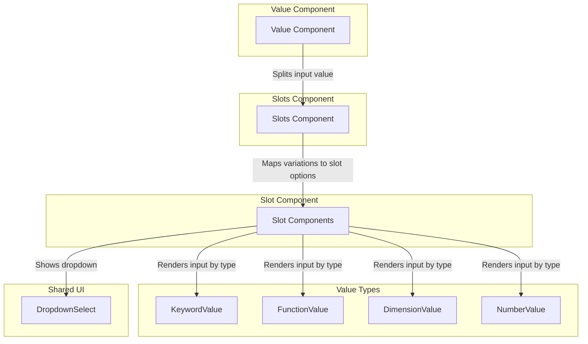

# Value Component Slot Lookup Table

## Description

When rendering CSS value editors, each possible value pattern (variation) is split into slots (columns) by top-level separators (space, comma, or slash). For a given set of variations, we want to build a lookup table that lists all unique possible options for each slot position. This enables incremental, context-aware UI rendering for complex CSS value syntaxes.

- **Variation:** A possible value pattern (row), e.g. `auto <number [0,∞]> / <number [0,∞]>`.
- **Slot:** A position (column) in the value pattern, e.g. the first, second, or third value in the sequence.
- **Slot Lookup Table:** For each slot index, a set of all unique options that can appear in that position across all variations.

## Example Variations

```
[
    "auto",
    "<number [0,∞]>",
    "auto <number [0,∞]>",
    "<number [0,∞]>  auto",
    "<number [0,∞]> / <number [0,∞]>",
    "auto <number [0,∞]> / <number [0,∞]>",
    "<number [0,∞]> / <number [0,∞]> auto",
    "test1 test2 test3"
]
```

## Slot Lookup Table

| Slot Index | Possible Options                       |
|:----------:|:---------------------------------------|
|     1      | auto, <number [0,∞]>, test1           |
|     2      | <number [0,∞]>, auto, test2           |
|     3      | <number [0,∞]>, auto, test3           |

- **Slot 1:** All unique values that appear in the first position of any variation.
- **Slot 2:** All unique values that appear in the second position of any variation.
- **Slot 3:** All unique values that appear in the third position of any variation.

## Usage

This lookup table can be used to:
- Render the correct dropdown/input for each slot as the user builds a value.
- Validate user input incrementally.
- Provide context-aware suggestions for each slot.

## Value Editor Component Flow Diagram



### Flow Description
- **Value**: Top-level component, receives property, manages value state, splits value into slots, and passes to Slots.
- **Slots**: Receives all slot values and variations, builds slot options, renders a Slot for each value and the next available slot.
- **Slot**: Receives a single value and its options, determines its type, and renders the appropriate input component (KeywordValue, FunctionValue, DimensionValue, NumberValue). Also renders a DropdownSelect for available options.
- **Input Components**: Render the actual input UI for each value type.

This flow enables incremental, slot-wise editing of complex CSS property values, with context-aware UI for each slot.

---

**Note:** The number of slots is determined by the maximum number of columns in any variation after splitting by top-level separators.
